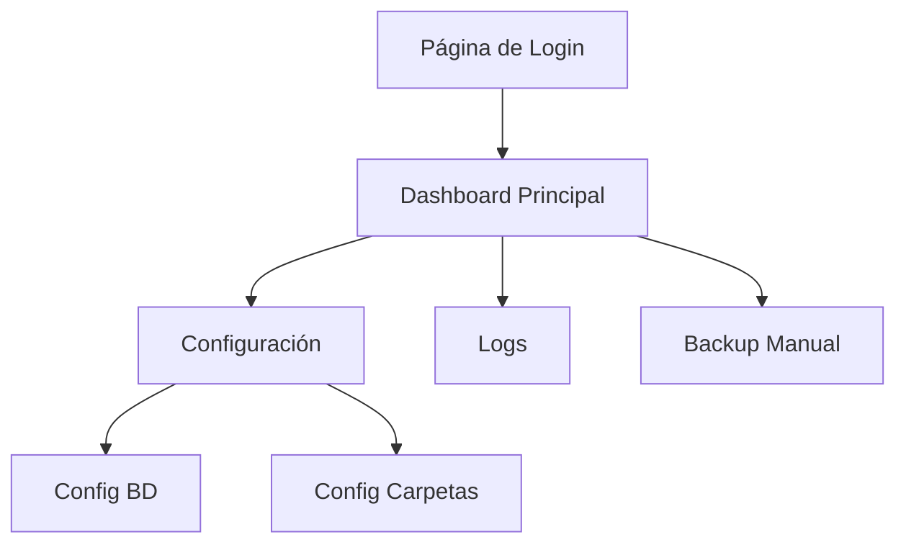

# Documento de Requerimientos del Producto - Sistema de Backup S3

## 1. Descripción General del Producto

Sistema integral de backup que permite respaldar carpetas locales y bases de datos a almacenamiento compatible con S3, con interfaz web de gestión y autenticación por sesiones.

El producto resuelve la necesidad de gestionar backups de archivos y bases de datos con una solución autocontenida que incluye interfaz de administración web y gestión de logs.

## 2. Características Principales

### 2.1 Roles de Usuario

| Rol | Método de Registro | Permisos Principales |
|-----|-------------------|---------------------|
| Administrador | Credenciales en archivo JSON | Acceso completo a configuración, logs y operaciones de backup |

### 2.2 Módulo de Características

Nuestros requerimientos de sistema de backup consisten en las siguientes páginas principales:

1. **Página de Login**: formulario de autenticación, validación de sesión
2. **Dashboard Principal**: resumen de estado, logs recientes, controles de backup manual
3. **Configuración**: gestión de credenciales S3, configuración de bases de datos, carpetas a respaldar
4. **Logs**: visualización de logs de operaciones, filtros por fecha

### 2.3 Detalles de Páginas

| Nombre de Página | Nombre del Módulo | Descripción de Características |
|------------------|-------------------|--------------------------------|
| Página de Login | Formulario de Autenticación | Validar credenciales de usuario, establecer sesión, redirección post-login |
| Dashboard Principal | Panel de Control | Mostrar estado del sistema, logs recientes, botón de backup manual, estadísticas de operaciones |
| Configuración | Gestión de Base de Datos | Configurar credenciales PostgreSQL/MySQL, host, puerto, nombre de BD |
| Configuración | Gestión de Carpetas | Seleccionar carpetas para backup, validar rutas, configurar exclusiones |
| Logs | Visualización de Logs | Mostrar logs paginados, filtros por fecha/tipo, descarga de logs |

**Nota:** La configuración S3 (endpoint, bucket, credenciales) ahora se gestiona a través de variables de entorno en el archivo .env del servidor.

## 3. Proceso Principal

**Flujo de Administrador:**
1. El administrador accede al sistema mediante login
2. Configura credenciales de bases de datos (las credenciales S3 se configuran en el archivo .env del servidor)
3. Selecciona carpetas para backup
4. Ejecuta backups manuales cuando sea necesario
5. Monitorea operaciones a través de logs
6. Puede ejecutar backups manuales cuando sea necesario

## 4. Diseño de Interfaz de Usuario

### 4.1 Estilo de Diseño

- **Colores primarios**: Azul (#2563eb) y gris oscuro (#1f2937)
- **Colores secundarios**: Verde (#10b981) para éxito, rojo (#ef4444) para errores
- **Estilo de botones**: Redondeados con sombras sutiles
- **Fuente**: Inter o system-ui, tamaños 14px-18px
- **Estilo de layout**: Diseño de tarjetas con navegación lateral
- **Iconos**: Feather icons o similar para consistencia

### 4.2 Resumen de Diseño de Páginas

| Nombre de Página | Nombre del Módulo | Elementos de UI |
|------------------|-------------------|----------------|
| Página de Login | Formulario de Autenticación | Formulario centrado, campos de entrada con validación visual, botón principal azul |
| Dashboard Principal | Panel de Control | Layout de tarjetas, indicadores de estado con colores, tabla de logs recientes |
| Configuración | Gestión de Credenciales BD | Formularios tabulados, campos de entrada agrupados, botones de prueba de conexión |
| Logs | Visualización de Logs | Tabla paginada, filtros desplegables, códigos de color para tipos de log |

### 4.3 Responsividad

Diseño desktop-first con adaptación móvil básica, optimización para interacción táctil en formularios y botones principales.