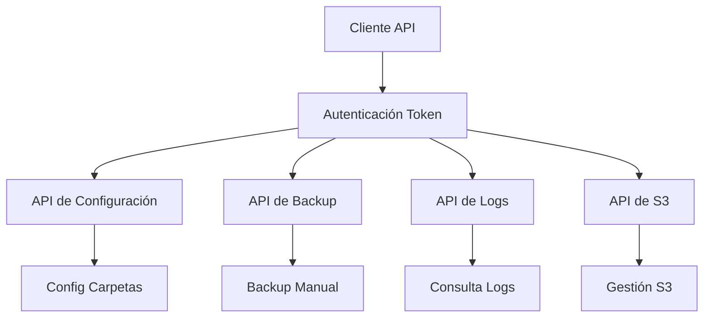

# Documento de Requerimientos del Producto - Sistema de Backup S3

## 1. Descripción General del Producto

Sistema integral de backup que permite respaldar carpetas locales y bases de datos a almacenamiento compatible con S3, mediante una API REST con autenticación por token.

El producto resuelve la necesidad de gestionar backups de archivos y bases de datos con una solución autocontenida que incluye API REST completa, gestión de logs avanzada y funcionalidades de administración de almacenamiento S3.

## 2. Características Principales

### 2.1 Autenticación y Acceso

| Método de Autenticación | Configuración | Permisos |
|------------------------|---------------|----------|
| API Token | Variable de entorno API_TOKEN | Acceso completo a todos los endpoints de la API |

### 2.2 Módulos de API

Nuestros requerimientos de sistema de backup consisten en los siguientes módulos de API:

1. **API de Backup**: ejecución de backups manuales, consulta de estado y estadísticas
2. **API de Configuración**: gestión de carpetas a respaldar, información del sistema
3. **API de Logs**: consulta de logs con filtros avanzados, estadísticas y exportación
4. **API de S3**: gestión de objetos, búsqueda, estadísticas de almacenamiento
5. **API de Salud**: endpoint de verificación del estado del servicio

### 2.3 Detalles de Endpoints de API

| Endpoint | Módulo | Descripción de Características |
|----------|--------|--------------------------------|
| POST /api/backup/now | Gestión de Backup | Ejecutar backup manual (completo, carpetas o base de datos) |
| GET /api/backup/status | Gestión de Backup | Consultar estado actual de backups en ejecución |
| GET /api/backup/stats | Gestión de Backup | Obtener estadísticas de operaciones de backup |
| GET /api/config | Gestión de Configuración | Obtener configuración actual de carpetas |
| POST /api/config | Gestión de Configuración | Actualizar configuración de carpetas a respaldar |
| GET /api/logs | Gestión de Logs | Consultar logs con paginación y filtros avanzados |
| GET /api/s3/objects | Gestión de S3 | Listar objetos en el almacenamiento S3 |
| GET /api/s3/stats | Gestión de S3 | Obtener estadísticas de uso del almacenamiento |
| GET /api/health | Monitoreo | Verificar estado del servicio |

**Nota:** Toda la configuración (S3, base de datos, autenticación) se gestiona a través de variables de entorno en el archivo .env del servidor.

## 3. Proceso Principal

**Flujo de Operación de API:**
1. El cliente se autentica usando el API token en el header
2. Configura carpetas para backup mediante POST /api/config
3. Ejecuta backups manuales mediante POST /api/backup/now
4. Monitorea estado de backups mediante GET /api/backup/status
5. Consulta logs y estadísticas mediante endpoints de logs y S3
6. Gestiona objetos en S3 mediante endpoints de gestión de almacenamiento

## 4. Especificaciones de API

### 4.1 Formato de Respuesta

- **Formato estándar**: JSON con estructura consistente
- **Códigos de estado**: HTTP estándar (200, 400, 401, 404, 500)
- **Estructura de éxito**: `{"success": true, "data": {...}}`
- **Estructura de error**: `{"success": false, "message": "...", "code": "..."}`
- **Paginación**: Incluye metadatos de página, límite y total
- **Timestamps**: Formato ISO 8601 (YYYY-MM-DDTHH:mm:ss.sssZ)

### 4.2 Autenticación y Seguridad

| Aspecto | Implementación |
|---------|----------------|
| Autenticación | Header `api-token` requerido en todas las peticiones |
| Validación | Joi schemas para validación de entrada |
| Sanitización | Middleware de sanitización de entrada y detección SQL injection |
| Rate Limiting | Limitación de peticiones por IP |
| Headers de Seguridad | Helmet.js para headers de seguridad |
| Logs de Seguridad | Registro de intentos de acceso no autorizados |

### 4.3 Manejo de Errores

- **Validación de entrada**: Errores 400 con detalles específicos
- **Autenticación**: Errores 401 con códigos de error específicos
- **Recursos no encontrados**: Errores 404 con mensajes descriptivos
- **Conflictos**: Errores 409 para operaciones en conflicto (backup en progreso)
- **Errores internos**: Errores 500 con logging detallado (sin exposición de detalles en producción)