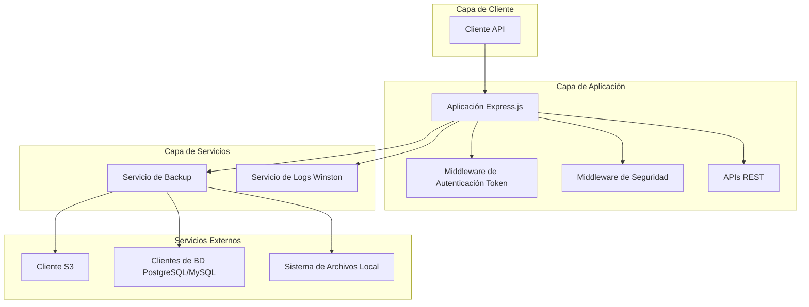
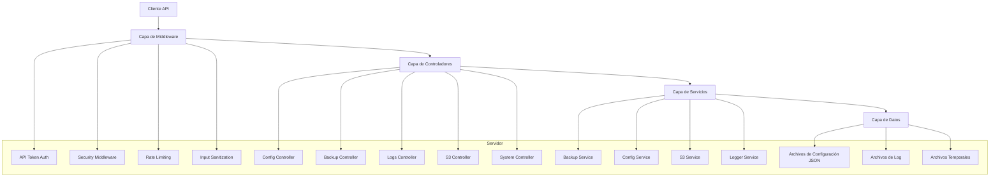
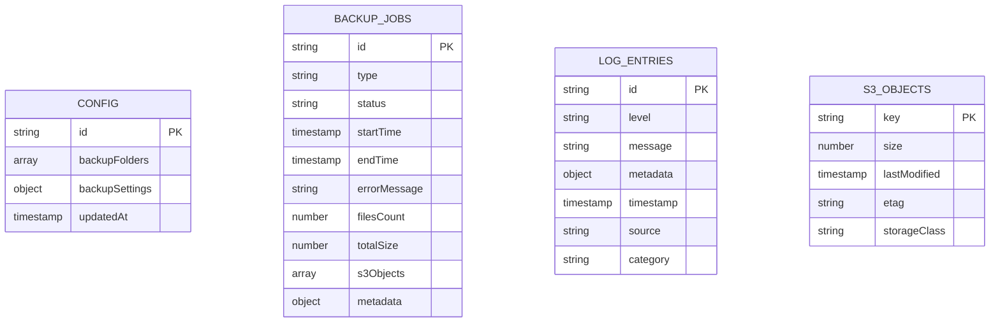

# Documento de Arquitectura Técnica - Sistema de Backup S3

## 1. Diseño de Arquitectura



## 2. Descripción de Tecnologías

* **API REST**: Node.js\@22 + Express.js\@4 (sin interfaz web)

* **Autenticación**: API Token basado en headers

* **Dependencias principales**:

  * winston (logging)


  * aws-sdk o @aws-sdk/client-s3 (S3)

  * pg (PostgreSQL)

  * mysql2 (MySQL)

  * archiver (compresión ZIP)

  * express-rate-limit (seguridad)

  * helmet (headers de seguridad)

## 3. Definiciones de Rutas

| Ruta                    | Método | Propósito                                    |
| ----------------------- | ------ | -------------------------------------------- |
| /api/config             | GET    | Obtener configuración actual del sistema    |
| /api/config             | POST   | Actualizar configuración del sistema        |
| /api/backup/now         | POST   | Ejecutar backup manual                      |
| /api/backup/status      | GET    | Obtener estado actual del backup           |
| /api/backup/stats       | GET    | Obtener estadísticas de backups            |
| /api/backup/history     | GET    | Obtener historial de backups               |
| /api/logs               | GET    | Obtener logs del sistema                    |
| /api/logs/stats         | GET    | Obtener estadísticas de logs               |
| /api/logs/recent        | GET    | Obtener logs recientes                      |
| /api/logs/export        | GET    | Exportar logs en formato específico        |
| /api/s3/objects         | GET    | Listar objetos en S3                       |
| /api/s3/objects/:key    | DELETE | Eliminar objeto específico de S3           |
| /api/s3/usage           | GET    | Obtener estadísticas de uso de S3          |
| /api/system/info        | GET    | Obtener información del sistema             |

## 4. Definiciones de API

### 4.1 APIs Principales

**Autenticación por Token**

Todas las peticiones a la API requieren el header de autenticación:

```
api-token: your-api-token-here
```

**Respuesta de error de autenticación:**

```json
{
  "success": false,
  "message": "Token de API requerido",
  "code": "MISSING_API_TOKEN"
}
```

**Códigos de error de autenticación:**
- `MISSING_API_TOKEN`: Header api-token no proporcionado
- `INVALID_API_TOKEN`: Token inválido o expirado
- `UNAUTHORIZED_ACCESS`: Acceso no autorizado al recurso

**Configuración del sistema**

```
GET /api/config
POST /api/config
```

Request (POST):

| Nombre del Parámetro | Tipo del Parámetro | Es Requerido | Descripción                                    |
| -------------------- | ------------------ | ------------ | ---------------------------------------------- |
| backupFolders        | array              | true         | Array de rutas de carpetas para backup        |
| backupSettings       | object             | false        | Configuraciones adicionales de backup         |

Response (GET):

| Nombre del Parámetro | Tipo del Parámetro | Descripción                                    |
| -------------------- | ------------------ | ---------------------------------------------- |
| backupFolders        | array              | Carpetas configuradas para backup             |
| backupSettings       | object             | Configuraciones de backup                     |
| s3Config             | object             | Configuración S3 (solo información pública)   |
| systemInfo           | object             | Información del sistema                       |

**Nota:** La configuración de S3 y base de datos se lee exclusivamente desde variables de entorno (.env) por seguridad. Solo las carpetas de backup y configuraciones relacionadas pueden modificarse via API.

**Logs del sistema**

```
GET /api/logs
```

Query Parameters:

| Nombre del Parámetro | Tipo del Parámetro | Es Requerido | Descripción                      |
| -------------------- | ------------------ | ------------ | -------------------------------- |
| page                 | number             | false        | Número de página (default: 1)    |
| limit                | number             | false        | Límite por página (default: 50)  |
| level                | string             | false        | Nivel de log (info, warn, error) |

**Backup manual**

```
POST /api/backup/now
```

Request:

| Nombre del Parámetro | Tipo del Parámetro | Es Requerido | Descripción                                   |
| -------------------- | ------------------ | ------------ | --------------------------------------------- |
| type                 | string             | true         | Tipo de backup ('folders', 'database', 'all') |

**Estado del backup**

```
GET /api/backup/status
```

Response:

| Nombre del Parámetro | Tipo del Parámetro | Descripción                    |
| -------------------- | ------------------ | ------------------------------ |
| isRunning            | boolean            | Si hay backup en ejecución     |
| currentJob           | object             | Información del trabajo actual |
| lastCompleted        | object             | Último backup completado       |

**Estadísticas de backup**

```
GET /api/backup/stats
```

Response:

| Nombre del Parámetro | Tipo del Parámetro | Descripción                      |
| -------------------- | ------------------ | -------------------------------- |
| totalBackups         | number             | Total de backups realizados      |
| successfulBackups    | number             | Backups exitosos                 |
| failedBackups        | number             | Backups fallidos                 |
| totalSize            | number             | Tamaño total de backups (bytes)  |
| averageDuration      | number             | Duración promedio (ms)           |

**Historial de backups**

```
GET /api/backup/history
```

Query Parameters:

| Nombre del Parámetro | Tipo del Parámetro | Es Requerido | Descripción                    |
| -------------------- | ------------------ | ------------ | ------------------------------ |
| page                 | number             | false        | Número de página (default: 1)  |
| limit                | number             | false        | Límite por página (default: 20) |
| status               | string             | false        | Filtrar por estado             |

**Gestión de objetos S3**

```
GET /api/s3/objects
```

Query Parameters:

| Nombre del Parámetro | Tipo del Parámetro | Es Requerido | Descripción                      |
| -------------------- | ------------------ | ------------ | -------------------------------- |
| prefix               | string             | false        | Prefijo para filtrar objetos     |
| maxKeys              | number             | false        | Máximo número de objetos         |

```
DELETE /api/s3/objects/:key
```

Path Parameters:

| Nombre del Parámetro | Tipo del Parámetro | Es Requerido | Descripción           |
| -------------------- | ------------------ | ------------ | --------------------- |
| key                  | string             | true         | Clave del objeto en S3 |

**Estadísticas de S3**

```
GET /api/s3/usage
```

Response:

| Nombre del Parámetro | Tipo del Parámetro | Descripción                    |
| -------------------- | ------------------ | ------------------------------ |
| totalObjects         | number             | Total de objetos en S3         |
| totalSize            | number             | Tamaño total usado (bytes)     |
| oldestObject         | object             | Objeto más antiguo             |
| newestObject         | object             | Objeto más reciente            |

**Estadísticas de logs**

```
GET /api/logs/stats
```

Response:

| Nombre del Parámetro | Tipo del Parámetro | Descripción                    |
| -------------------- | ------------------ | ------------------------------ |
| totalLogs            | number             | Total de entradas de log       |
| logsByLevel          | object             | Conteo por nivel de log        |
| recentErrors         | number             | Errores en últimas 24h        |

**Logs recientes**

```
GET /api/logs/recent
```

Query Parameters:

| Nombre del Parámetro | Tipo del Parámetro | Es Requerido | Descripción                    |
| -------------------- | ------------------ | ------------ | ------------------------------ |
| hours                | number             | false        | Horas hacia atrás (default: 24) |
| level                | string             | false        | Nivel de log a filtrar         |

**Exportar logs**

```
GET /api/logs/export
```

Query Parameters:

| Nombre del Parámetro | Tipo del Parámetro | Es Requerido | Descripción                    |
| -------------------- | ------------------ | ------------ | ------------------------------ |
| format               | string             | false        | Formato (json, csv, txt)       |
| startDate            | string             | false        | Fecha inicio (ISO 8601)        |
| endDate              | string             | false        | Fecha fin (ISO 8601)           |

**Información del sistema**

```
GET /api/system/info
```

Response:

| Nombre del Parámetro | Tipo del Parámetro | Descripción                    |
| -------------------- | ------------------ | ------------------------------ |
| version              | string             | Versión de la aplicación       |
| uptime               | number             | Tiempo de actividad (ms)       |
| memoryUsage          | object             | Uso de memoria                 |
| diskSpace            | object             | Espacio en disco               |
| nodeVersion          | string             | Versión de Node.js             |

## 5. Seguridad y Middleware

### 5.1 Funcionalidades de Seguridad

**Autenticación por API Token**
- Sistema de autenticación basado en tokens API
- Validación de tokens en cada request
- Tokens configurados en variables de entorno
- Sin manejo de sesiones web

**Middleware de Seguridad Implementado**

1. **API Token Authentication**
   - Validación del header `Authorization: Bearer <token>`
   - Verificación contra tokens configurados en `.env`
   - Respuesta 401 para tokens inválidos o faltantes

2. **Input Sanitization**
   - Sanitización de parámetros de entrada
   - Validación de tipos de datos
   - Prevención de inyección de código

3. **Rate Limiting**
   - Limitación de requests por IP
   - Protección contra ataques de fuerza bruta
   - Configuración ajustable por endpoint

4. **CORS (Cross-Origin Resource Sharing)**
   - Configuración de orígenes permitidos
   - Headers de seguridad apropiados
   - Métodos HTTP permitidos

5. **Request Validation**
   - Validación de esquemas JSON
   - Verificación de parámetros requeridos
   - Respuestas de error estructuradas

**Variables de Entorno de Seguridad**

```bash
# Tokens de API
API_TOKENS=token1,token2,token3

# Configuración de Rate Limiting
RATE_LIMIT_WINDOW_MS=900000
RATE_LIMIT_MAX_REQUESTS=100

# CORS
CORS_ORIGIN=*
CORS_METHODS=GET,POST,PUT,DELETE

# Logging de Seguridad
SECURITY_LOG_LEVEL=warn
SECURITY_LOG_FAILED_AUTH=true
```

## 7. Diagrama de Arquitectura del Servidor



## 8. Modelo de Datos

### 8.1 Definición del Modelo de Datos



### 8.2 Lenguaje de Definición de Datos

**Archivo de Configuración (config.json)**

```json
{
  "dbConfig": {
    "type": "postgresql",
    "host": "localhost",
    "port": 5432,
    "username": "dbuser",
    "password": "dbpass",
    "database": "mydb"
  },
  "backupFolders": [
    "/path/to/folder1",
    "/path/to/folder2"
  ],

  "updatedAt": "2024-01-01T00:00:00Z"
}
```

**Archivo de Variables de Entorno (.env)**

```env
# Configuración del servidor
PORT=3000
NODE_ENV=development
LOG_LEVEL=info

# Configuración de seguridad
API_TOKEN=your-secure-api-token-here
RATE_LIMIT_WINDOW_MS=900000
RATE_LIMIT_MAX_REQUESTS=100

# Configuración S3
S3_ENDPOINT=https://s3.amazonaws.com
S3_BUCKET=my-backup-bucket
S3_ACCESS_KEY=your-access-key-here
S3_SECRET_KEY=your-secret-key-here
S3_REGION=us-east-1

# Configuración de logs
LOG_MAX_SIZE=20m
LOG_MAX_FILES=14d
LOG_DATE_PATTERN=YYYY-MM-DD
```

**Archivo de Configuración de Backup (config.json)**

```json
{
  "backupFolders": [
    "/path/to/folder1",
    "/path/to/folder2"
  ],
  "backupSettings": {
    "compression": true,
    "excludePatterns": ["*.tmp", "node_modules"],
    "maxFileSize": 104857600,
    "retentionDays": 30
  },
  "updatedAt": "2024-01-01T00:00:00Z"
}
```

**Estructura de Logs (winston)**

```javascript
// Configuración de winston
const logFormat = winston.format.combine(
  winston.format.timestamp(),
  winston.format.errors({ stack: true }),
  winston.format.json()
);

// Rotación mensual de archivos
const fileRotateTransport = new winston.transports.DailyRotateFile({
  filename: 'logs/backup-%DATE%.log',
  datePattern: 'YYYY-MM',
  maxFiles: '12m'
});
```

**Estructura de Trabajo de Backup**

```javascript
// Ejemplo de entrada de log de backup
{
  "id": "backup-20240101-120000",
  "type": "manual",
  "status": "completed",
  "startTime": "2024-01-01T12:00:00Z",
  "endTime": "2024-01-01T12:15:30Z",
  "filesCount": 1250,
  "totalSize": 524288000,
  "s3Objects": [
    {
      "key": "backups/folders/2024-01-01-folders.zip",
      "size": 314572800,
      "etag": "d41d8cd98f00b204e9800998ecf8427e"
    },
    {
      "key": "backups/database/2024-01-01-database.zip",
      "size": 209715200,
      "etag": "098f6bcd4621d373cade4e832627b4f6"
    }
  ],
  "metadata": {
    "triggeredBy": "api",
    "compressionRatio": 0.65,
    "excludedFiles": 45,
    "errors": [],
    "warnings": ["Large file skipped: /path/to/largefile.iso"]
  }
}
```

**Estructura de Log Entries**

```javascript
// Ejemplo de entrada de log del sistema
{
  "id": "log-20240101-120001",
  "level": "info",
  "message": "Backup completed successfully",
  "timestamp": "2024-01-01T12:00:01Z",
  "source": "BackupService",
  "category": "backup",
  "metadata": {
    "backupId": "backup-20240101-120000",
    "duration": 930000,
    "filesProcessed": 1250,
    "totalSize": 524288000
  }
}
```

**Estructura de Objetos S3**

```javascript
// Ejemplo de objeto S3 almacenado
{
  "key": "backups/folders/2024-01-01-folders.zip",
  "size": 314572800,
  "lastModified": "2024-01-01T12:15:30Z",
  "etag": "d41d8cd98f00b204e9800998ecf8427e",
  "storageClass": "STANDARD"
}
```

