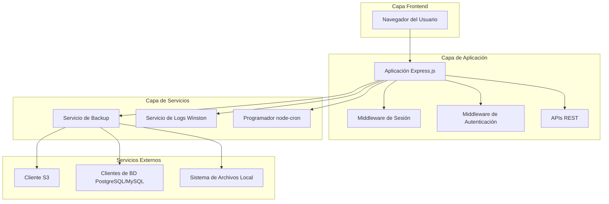
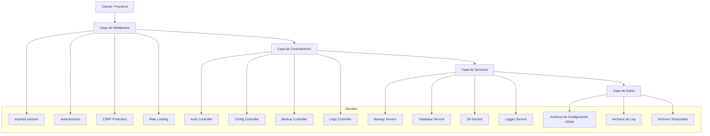
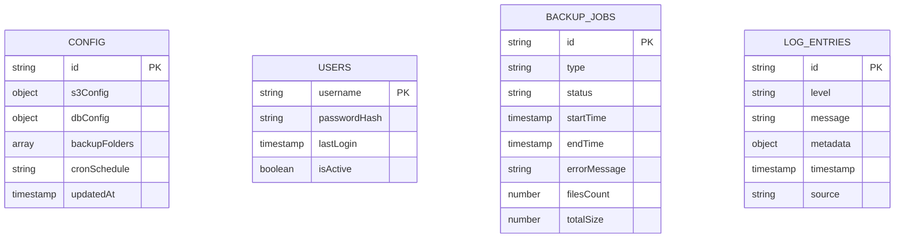

# Documento de Arquitectura Técnica - Sistema de Backup S3

## 1. Diseño de Arquitectura



## 2. Descripción de Tecnologías

* **Frontend**: HTML5 + CSS3 + JavaScript vanilla

* **Backend**: Node.js\@22 + Express.js\@4 + express-session

* **Dependencias principales**:

  * winston (logging)

  * node-cron (programación)

  * aws-sdk o @aws-sdk/client-s3 (S3)

  * pg (PostgreSQL)

  * mysql2 (MySQL)

  * archiver (compresión ZIP)

  * express-rate-limit (seguridad)

  * helmet (headers de seguridad)

## 3. Definiciones de Rutas

| Ruta            | Propósito                                             |
| --------------- | ----------------------------------------------------- |
| /               | Página principal, redirige a /login si no autenticado |
| /login          | Página de login, formulario de autenticación          |
| /dashboard      | Dashboard principal con resumen y controles           |
| /config         | Página de configuración del sistema                   |
| /logs           | Página de visualización de logs                       |
| /api/login      | Endpoint de autenticación POST                        |
| /api/logout     | Endpoint de cierre de sesión POST                     |
| /api/config     | Endpoints GET/POST para configuración                 |
| /api/logs       | Endpoint GET para obtener logs                        |
| /api/backup-now | Endpoint POST para backup manual                      |

## 4. Definiciones de API

### 4.1 APIs Principales

**Autenticación de usuario**

```
POST /api/login
```

Request:

| Nombre del Parámetro | Tipo del Parámetro | Es Requerido | Descripción               |
| -------------------- | ------------------ | ------------ | ------------------------- |
| username             | string             | true         | Nombre de usuario         |
| password             | string             | true         | Contraseña en texto plano |

Response:

| Nombre del Parámetro | Tipo del Parámetro | Descripción                |
| -------------------- | ------------------ | -------------------------- |
| success              | boolean            | Estado de la autenticación |
| message              | string             | Mensaje de respuesta       |

Ejemplo:

```json
{
  "username": "admin",
  "password": "secretpassword"
}
```

**Configuración del sistema**

```
GET /api/config
POST /api/config
```

Request (POST):

| Nombre del Parámetro | Tipo del Parámetro | Es Requerido | Descripción                                                       |
| -------------------- | ------------------ | ------------ | ----------------------------------------------------------------- |
| dbConfig             | object             | true         | Configuración BD (type, host, port, username, password, database) |
| backupFolders        | array              | true         | Array de rutas de carpetas para backup                            |
| cronSchedule         | string             | true         | Expresión cron para programación                                  |

**Nota:** La configuración S3 ahora se lee desde variables de entorno (.env) en lugar de la interfaz web.

**Logs del sistema**

```
GET /api/logs
```

Query Parameters:

| Nombre del Parámetro | Tipo del Parámetro | Es Requerido | Descripción                      |
| -------------------- | ------------------ | ------------ | -------------------------------- |
| page                 | number             | false        | Número de página (default: 1)    |
| limit                | number             | false        | Límite por página (default: 50)  |
| level                | string             | false        | Nivel de log (info, warn, error) |

**Backup manual**

```
POST /api/backup-now
```

Request:

| Nombre del Parámetro | Tipo del Parámetro | Es Requerido | Descripción                                   |
| -------------------- | ------------------ | ------------ | --------------------------------------------- |
| type                 | string             | true         | Tipo de backup ('folders', 'database', 'all') |

## 5. Diagrama de Arquitectura del Servidor



## 6. Modelo de Datos

### 6.1 Definición del Modelo de Datos



### 6.2 Lenguaje de Definición de Datos

**Archivo de Configuración (config.json)**

```json
{
  "dbConfig": {
    "type": "postgresql",
    "host": "localhost",
    "port": 5432,
    "username": "dbuser",
    "password": "dbpass",
    "database": "mydb"
  },
  "backupFolders": [
    "/path/to/folder1",
    "/path/to/folder2"
  ],
  "cronSchedule": "0 2 * * *",
  "updatedAt": "2024-01-01T00:00:00Z"
}
```

**Archivo de Variables de Entorno (.env)**

```env
# Configuración del servidor
PORT=3000
NODE_ENV=development
SESSION_SECRET=backup-s3-secret-key-change-in-production
LOG_LEVEL=info

# Configuración S3
S3_ENDPOINT=https://s3.amazonaws.com
S3_BUCKET=my-backup-bucket
S3_ACCESS_KEY=your-access-key-here
S3_SECRET_KEY=your-secret-key-here
S3_REGION=us-east-1
```

**Archivo de Usuarios (users.json)**

```json
{
  "users": [
    {
      "username": "admin",
      "passwordHash": "$2b$10$...",
      "lastLogin": "2024-01-01T00:00:00Z",
      "isActive": true
    }
  ]
}
```

**Estructura de Logs (winston)**

```javascript
// Configuración de winston
const logFormat = winston.format.combine(
  winston.format.timestamp(),
  winston.format.errors({ stack: true }),
  winston.format.json()
);

// Rotación mensual de archivos
const fileRotateTransport = new winston.transports.DailyRotateFile({
  filename: 'logs/backup-%DATE%.log',
  datePattern: 'YYYY-MM',
  maxFiles: '12m'
});
```

**Estructura de Trabajo de Backup**

```javascript
// Ejemplo de entrada de log de backup
{
  "id": "backup-20240101-120000",
  "type": "scheduled",
  "status": "completed",
  "startTime": "2024-01-01T12:00:00Z",
  "endTime": "2024-01-01T12:15:30Z",
  "filesCount": 1250,
  "totalSize": 524288000,
  "s3Objects": [
    "backups/folders/2024-01-01-folders.zip",
    "backups/database/2024-01-01-database.zip"
  ]
}
```

